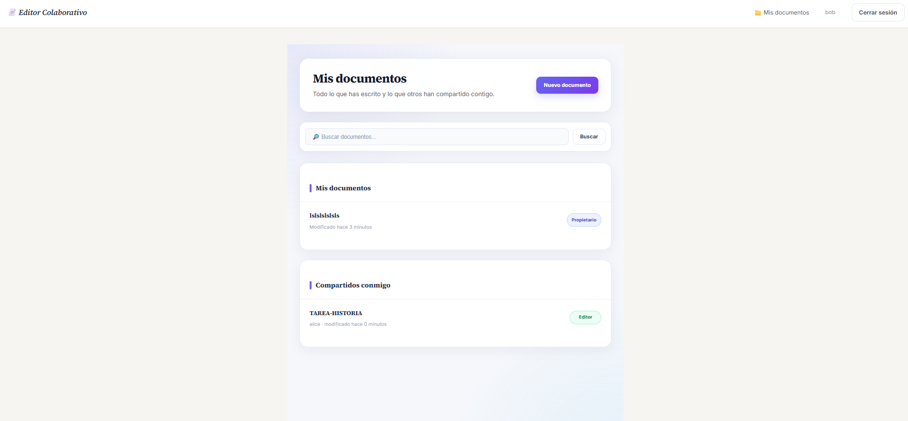
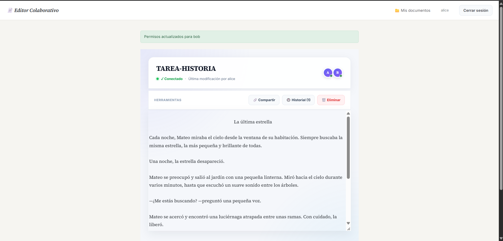

# 📄 Editor Colaborativo

Aplicación web de edición colaborativa de documentos en tiempo real, desarrollada con **Django** y **Django Channels**. Permite a los usuarios crear documentos, compartirlos con otros usuarios con diferentes niveles de acceso, editar simultáneamente mediante WebSockets y consultar o restaurar versiones anteriores.

> **Proyecto educativo / portafolio.** La configuración actual está orientada al desarrollo y a escenarios de despliegue documentados en el proyecto.

---

## 📌 Descripción

**Editor Colaborativo** es una aplicación web que combina las funcionalidades tradicionales de gestión de documentos de Django con comunicación en tiempo real mediante WebSockets.

Los usuarios autenticados pueden:

- Crear documentos.
- Consultar sus documentos.
- Compartir documentos con otros usuarios.
- Asignar permisos de **Editor** o **Lector**.
- Editar documentos en tiempo real cuando tienen permiso.
- Ver qué usuarios están conectados al documento.
- Ver cuándo otro usuario está escribiendo.
- Guardar automáticamente los cambios.
- Consultar el historial de versiones.
- Restaurar versiones anteriores cuando son propietarios del documento.
- Eliminar sus propios documentos.

---
<!-- Opción A: Cierra la etiqueta si tienes una segunda imagen -->
<p align="center">
  
  
</p>


## 🎯 Objetivos del proyecto

1. Implementar autenticación de usuarios utilizando Django.
2. Desarrollar un sistema de documentos con control de propietario y permisos.
3. Incorporar edición colaborativa mediante WebSockets.
4. Implementar permisos diferenciados entre propietarios, editores y lectores.
5. Mantener un historial de versiones de los documentos.
6. Aplicar una interfaz web responsive y organizada.
7. Implementar pruebas automatizadas para las funcionalidades principales.

---

## ✨ Funcionalidades

### 👤 Usuarios

El sistema incluye:

- Registro de usuarios.
- Inicio de sesión.
- Cierre de sesión.
- Validación de campos obligatorios.
- Validación de coincidencia de contraseñas.
- Validación de longitud mínima de contraseña.
- Validación de nombres de usuario y correos electrónicos duplicados.
- Mensajes de error para facilitar la identificación de problemas.

---

### 📁 Gestión de documentos

Cada usuario puede gestionar sus documentos de acuerdo con sus permisos.

Funciones disponibles:

- Crear documentos.
- Definir título y contenido inicial.
- Consultar documentos.
- Editar documentos cuando corresponde.
- Eliminar documentos propios.
- Identificar al propietario.
- Registrar el último usuario que modificó el documento.
- Registrar fecha de creación y actualización.

El panel principal separa:

- **Mis documentos**
- **Compartidos conmigo**

También permite realizar búsquedas por título respetando los permisos de acceso.

---

## 🔐 Sistema de permisos

Los documentos manejan tres roles principales:

| Rol | Ver | Editar | Compartir | Eliminar | Restaurar |
|---|---:|---:|---:|---:|---:|
| **Propietario** | ✅ | ✅ | ✅ | ✅ | ✅ |
| **Editor** | ✅ | ✅ | ❌ | ❌ | ❌ |
| **Lector** | ✅ | ❌ | ❌ | ❌ | ❌ |

### Propietario

El propietario tiene control completo sobre el documento.

Puede:

- Verlo.
- Editarlo.
- Compartirlo.
- Cambiar permisos.
- Revocar permisos.
- Eliminarlo.
- Consultar el historial.
- Restaurar versiones anteriores.

### Editor

Puede:

- Ver el documento.
- Modificar su contenido.

No puede administrar los permisos ni restaurar versiones.

### Lector

Puede:

- Ver el documento.

No puede modificarlo ni administrar el documento.

---

## 🤝 Compartir documentos

El propietario puede compartir un documento con otros usuarios.

El sistema permite:

- Seleccionar un usuario.
- Otorgar permiso de **Editor**.
- Otorgar permiso de **Lector**.
- Actualizar el permiso existente.
- Revocar el acceso.
- Evitar que el propietario se comparta el documento consigo mismo.

Los permisos son comprobados tanto en las vistas HTTP como en el consumidor WebSocket.

---

# ⚡ Edición colaborativa en tiempo real

La comunicación en tiempo real se implementa mediante:

- **Django Channels**
- **WebSockets**
- **Daphne**
- `DocumentoConsumer`

Cuando un usuario abre un documento:

1. Se comprueba que esté autenticado.
2. Se comprueba que tenga permiso para visualizarlo.
3. Se establece la conexión WebSocket.
4. El usuario entra al grupo correspondiente al documento.
5. Se envía el contenido actual.
6. Se informa de los usuarios conectados.
7. Se comunica el último usuario que modificó el documento.

Durante la edición:

- El cliente envía cambios mediante WebSocket.
- El servidor comprueba el permiso de edición.
- El contenido se guarda.
- Se envía una confirmación de guardado.
- El cambio se transmite a los demás usuarios conectados.
- Se comunica el estado de escritura.

### ⏱️ Guardado

El cliente utiliza un mecanismo de espera antes de enviar cambios para evitar enviar una solicitud por cada tecla. El guardado colaborativo utiliza un enfoque de **última escritura válida (last-write-wins)**.

El sistema no implementa actualmente CRDT ni OT.

---

## 📝 Historial de versiones

Los cambios del documento pueden quedar registrados como versiones.

Cada versión almacena:

- Documento asociado.
- Contenido.
- Usuario que produjo la versión.
- Fecha de creación.

El historial permite:

- Consultar versiones anteriores.
- Visualizar el contenido de una versión.
- Restaurar una versión.

### Restauración

La restauración está limitada al propietario.

Antes de reemplazar el contenido actual, el estado actual se guarda como una nueva versión. Posteriormente se aplica el contenido de la versión seleccionada.

Para evitar generar una versión por cada actualización inmediata, el consumidor utiliza un intervalo mínimo de **20 segundos** entre snapshots automáticos cuando corresponde.

---

# 🏗️ Arquitectura

La aplicación utiliza Django para las peticiones HTTP y Django Channels para la comunicación WebSocket.

```text
                    ┌──────────────────────┐
                    │      Navegador       │
                    │   HTML / CSS / JS    │
                    └──────────┬───────────┘
                               │
                  ┌────────────┴────────────┐
                  │                         │
                 HTTP                    WebSocket
                  │                         │
                  ▼                         ▼
        ┌───────────────────┐     ┌───────────────────┐
        │ Django Views      │     │      Daphne       │
        │ Templates         │     │       ASGI        │
        │ Auth              │     └─────────┬─────────┘
        │ Permisos          │               │
        └─────────┬─────────┘               ▼
                  │                ┌───────────────────┐
                  │                │ Django Channels   │
                  │                │ DocumentoConsumer │
                  │                └─────────┬─────────┘
                  │                          │
                  └──────────────┬───────────┘
                                 ▼
                         ┌─────────────────┐
                         │     SQLite      │
                         │  Documentos     │
                         │  Permisos       │
                         │  Versiones      │
                         └─────────────────┘
```

---

## 🧰 Tecnologías utilizadas

| Tecnología | Uso |
|---|---|
| **Python 3** | Lenguaje principal |
| **Django 5.0** | Framework web |
| **Django Channels 4** | Comunicación WebSocket |
| **Daphne** | Servidor ASGI |
| **SQLite** | Base de datos |
| **HTML5** | Estructura de la interfaz |
| **CSS3** | Diseño y responsive |
| **JavaScript** | Interacción del cliente |
| **Django Auth** | Autenticación |
| **WhiteNoise** | Gestión de archivos estáticos |

> Actualmente el proyecto utiliza `InMemoryChannelLayer`; no requiere Redis para la configuración actual.

---

# 🗃️ Modelo de datos

La aplicación utiliza tres modelos principales.

## Documento

Representa un documento creado por un usuario.

Campos principales:

- `titulo`
- `contenido`
- `propietario`
- `creado`
- `actualizado`
- `ultimo_editor`

## PermisoDocumento

Relaciona un documento con un usuario autorizado.

Campos principales:

- `documento`
- `usuario`
- `puede_editar`
- `compartido_por`
- `fecha_compartido`

La combinación documento + usuario es única.

## VersionDocumento

Almacena versiones del contenido.

Campos principales:

- `documento`
- `contenido`
- `usuario`
- `fecha`

Las versiones se ordenan desde la más reciente.

---

# 📂 Estructura del proyecto

```text
Editor-Colaborativo/
│
├── manage.py
├── requirements.txt
├── startup.sh
├── setup_usuarios_prueba.py
├── .gitignore
│
├── proyecto/
│   ├── settings.py
│   ├── urls.py
│   ├── asgi.py
│   └── wsgi.py
│
├── editor/
│   ├── admin.py
│   ├── apps.py
│   ├── models.py
│   ├── views.py
│   ├── consumers.py
│   ├── routing.py
│   │
│   ├── migrations/
│   │   └── ...
│   │
│   ├── static/
│   │   └── editor/
│   │       └── css/
│   │           └── style.css
│   │
│   └── templates/
│       └── editor/
│           ├── base.html
│           ├── dashboard.html
│           ├── crear_documento.html
│           ├── documento.html
│           ├── compartir.html
│           ├── historial.html
│           ├── version.html
│           └── eliminar_documento.html
│
└── tests/
    └── ...
```

---

# 🚀 Instalación

## 1. Clonar el repositorio

```bash
git clone <URL_DEL_REPOSITORIO>
cd Editor-Colaborativo
```

## 2. Crear entorno virtual

### Windows

```bash
python -m venv venv
venv\Scripts\activate
```

### Linux / macOS

```bash
python3 -m venv venv
source venv/bin/activate
```

---

## 3. Instalar dependencias

```bash
pip install -r requirements.txt
```

---

## 4. Configurar variables de entorno

La aplicación utiliza variables de entorno para configuraciones como:

```env
SECRET_KEY=tu-clave-secreta
DEBUG=True
WEBSITE_HOSTNAME=localhost
DJANGO_LOG_LEVEL=INFO
```

Para un entorno de producción:

```env
DEBUG=False
SECRET_KEY=una-clave-segura
```

**No publiques una `SECRET_KEY` real en GitHub.**

---

## 5. Ejecutar migraciones

```bash
python manage.py migrate
```

---

## 6. Recopilar archivos estáticos

```bash
python manage.py collectstatic
```

---

## 7. Crear usuarios de prueba

Si se utiliza el script incluido:

```bash
python setup_usuarios_prueba.py
```

---

# ▶️ Ejecutar el proyecto

Con el entorno virtual activado:

```bash
python manage.py runserver
```

Luego abre:

```text
http://127.0.0.1:8000/
```

La configuración ASGI permite que el proyecto maneje las conexiones WebSocket mediante Daphne/Channels.

---

# 🧪 Pruebas

El proyecto incluye pruebas automatizadas para diferentes partes de la aplicación.

Para ejecutar las pruebas:

```bash
python manage.py test editor
```

Las pruebas contemplan funcionalidades relacionadas con:

- Usuarios.
- Documentos.
- Permisos.
- Historial.
- Búsqueda.
- Comunicación WebSocket.

El conjunto documentado actualmente contiene **38 pruebas automatizadas**.

---

# 🛡️ Seguridad y control de acceso

El proyecto realiza comprobaciones de autorización antes de ejecutar operaciones sensibles.

Entre ellas:

- Verificación de autenticación.
- Verificación de permiso de visualización.
- Verificación de permiso de edición.
- Restricción de administración de permisos al propietario.
- Restricción de eliminación al propietario.
- Restricción de restauración al propietario.
- Validación de permisos también dentro del consumidor WebSocket.

Esto evita depender únicamente de la interfaz para controlar las operaciones.

---

# 🖥️ Interfaz

La interfaz está desarrollada con HTML, CSS y JavaScript sin utilizar frameworks frontend como React o Vue.

Características del diseño:

- Diseño responsive.
- Tipografía **Source Serif 4** para contenido editorial.
- Tipografía **Inter** para elementos de interfaz.
- Sistema visual basado en tonos de papel, tinta y acento ámbar.
- Estados de foco visibles.
- Adaptación para diferentes tamaños de pantalla.
- Consideración de `prefers-reduced-motion`.

---

# ⚙️ Administración de Django

El proyecto incorpora Django Admin para administrar:

- `Documento`
- `PermisoDocumento`

El administrador permite consultar y filtrar información relevante.

Para crear un superusuario:

```bash
python manage.py createsuperuser
```

Después:

```text
http://127.0.0.1:8000/admin/
```

---

# 📡 Rutas principales

| Ruta | Función |
|---|---|
| `/` | Inicio / login |
| `/registro/` | Registro |
| `/dashboard/` | Panel de documentos |
| `/documento/<id>/` | Visualización y edición |
| `/documento/crear/` | Crear documento |
| `/documento/<id>/compartir/` | Compartir documento |
| `/documento/<id>/eliminar/` | Eliminar documento |
| `/documento/<id>/historial/` | Historial de versiones |
| `/documento/<id>/version/<version_id>/` | Consultar versión |
| `/documento/<id>/version/<version_id>/restaurar/` | Restaurar versión |
| `/admin/` | Administración Django |

### WebSocket

```text
ws/documento/<doc_id>/
```

---

# 🔄 Flujo de colaboración

```text
Usuario A abre documento
        │
        ▼
Se verifica autenticación
        │
        ▼
Se verifica permiso de lectura
        │
        ▼
Conexión WebSocket
        │
        ▼
Se une al grupo del documento
        │
        ▼
Recibe contenido actual
        │
        ▼
Usuario A modifica contenido
        │
        ▼
Servidor verifica permiso de edición
        │
        ▼
Se guarda el documento
        │
        ▼
Se actualiza último editor
        │
        ▼
Se crea snapshot cuando corresponde
        │
        ▼
Se transmite el cambio
        │
        ▼
Otros usuarios reciben actualización
```
---
# 🔮 Posibles mejoras futuras

Estas funcionalidades **no forman parte de la implementación actual** y se presentan únicamente como posibles extensiones:

- Implementar Redis para la capa de Channels.
- Incorporar CRDT u OT para resolución avanzada de conflictos.
- Añadir edición enriquecida.
- Añadir comentarios.
- Añadir notificaciones.
- Incorporar control de versiones más avanzado.
- Implementar permisos adicionales.
- Añadir almacenamiento de archivos.
- Incorporar más pruebas de integración.
- Mejorar las medidas de seguridad para producción.
- Incorporar CI/CD.

---

# ☁️ Despliegue

El proyecto contiene configuración orientada al despliegue mediante **Azure App Service Linux**, utilizando el script:

```text
startup.sh
```

El proceso documentado contempla operaciones como:

```text
migrate
collectstatic
daphne
```

Antes de realizar un despliegue real deben configurarse correctamente las variables de entorno y los parámetros de producción.

---

# 📋 Estado actual

| Componente | Estado |
|---|---|
| Autenticación | ✅ Implementado |
| Registro | ✅ Implementado |
| Documentos | ✅ Implementado |
| Compartir documentos | ✅ Implementado |
| Roles de acceso | ✅ Implementado |
| Edición colaborativa | ✅ Implementado |
| WebSockets | ✅ Implementado |
| Historial | ✅ Implementado |
| Restauración | ✅ Implementado |
| Búsqueda | ✅ Implementado |
| Django Admin | ✅ Implementado |
| Pruebas automatizadas | ✅ Implementado |
| Redis | ⏳ No implementado |
| CRDT / OT | ⏳ No implementado |
| Comentarios | ⏳ No implementado |
| Notificaciones avanzadas | ⏳ No implementado |

---

# 📚 Propósito académico

Este proyecto permite aplicar conocimientos de:

- Desarrollo web con Django.
- Arquitectura MVC/MVT.
- Bases de datos relacionales.
- Autenticación y autorización.
- Programación asíncrona.
- WebSockets.
- Desarrollo frontend.
- Control de versiones.
- Pruebas automatizadas.
- Despliegue de aplicaciones web.

---

# 👨‍💻 Autor

ANDRES CONTRERAS , WILMER FLORES

---

